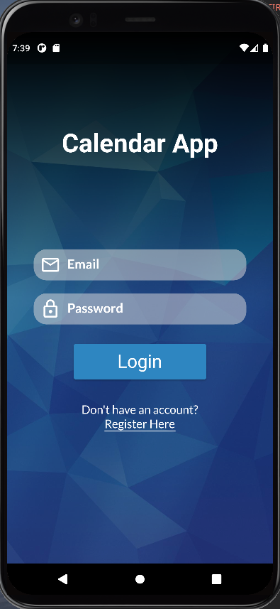
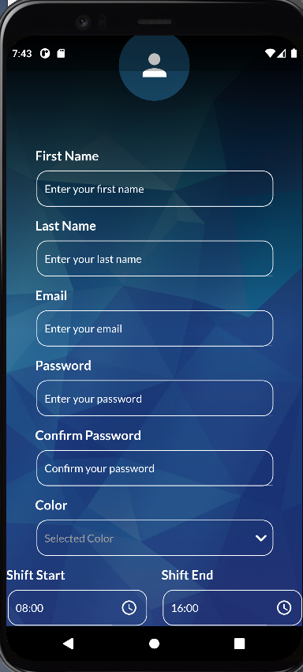
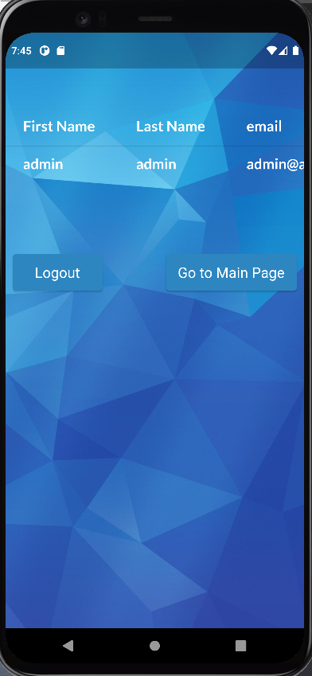
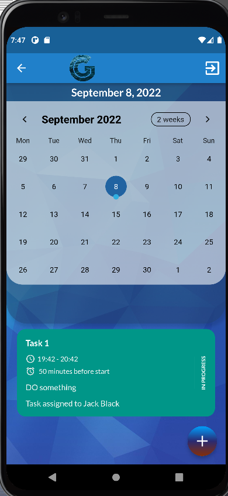
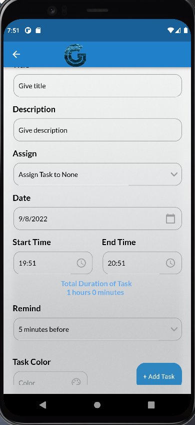
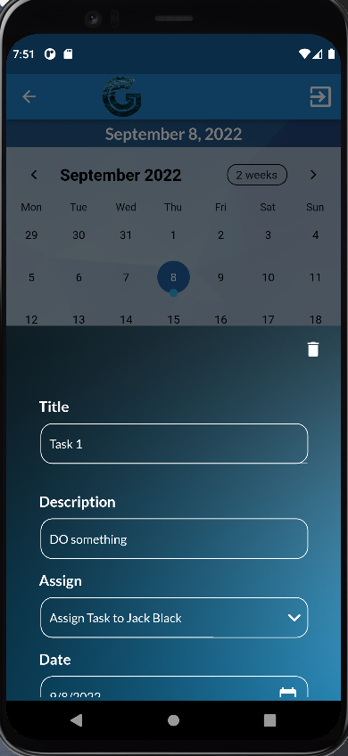

# Flutter_Calendar_app

Has a login and register page. 
Currently has a sqlfite version which stores data locally
and a Firebase version.
It has an admin and a user view.
After the login you are redirected to the main page which has:
A top view with a whole calendar 
A bottom view with the tasks and their info
A add task button which redirects you the the add task page.
A bottom sheet where you can edit the tasks.

 
        
|                Front Page                              |Register Page                                             |                   User Info                           |
|                :-------------                          |:---:                                                     |                   -------------:                      |
|&nbsp;&nbsp;|&nbsp;&nbsp;|&nbsp;&nbsp;|
|                                                        |                                                          |                                                       |

|Calendar Page                                             |Add Task Page                                           |Edit View                                                |
|:-------------                                            |:---:                                                   |-------------:                                           |
|&nbsp;&nbsp;|&nbsp;&nbsp;|&nbsp;&nbsp;| 